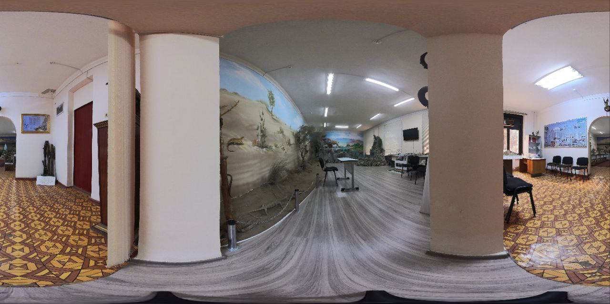

# Jaytap - Real Estate Flutter Application

A feature-rich real estate application built with Flutter. It allows users to find properties, view details, and connect with realtors.

## Features

- **User Authentication:** Secure login and registration system.
- **Property Listings:** Browse a list of available properties with filtering and search functionality.
- **Property Details:** View detailed information about each property, including images, price, and description.
- **Interactive Map:** See properties on a map and find properties nearby.
- **Favorites:** Save favorite properties to view later.
- **Chat:** Communicate with realtors or property owners.
- **User Profile:** Manage user profile and settings.
- **Multi-language Support:** The application is designed to support multiple languages.

## Tech Stack & Dependencies

- **Flutter:** The UI toolkit for building natively compiled applications for mobile, web, and desktop from a single codebase.
- **Firebase:**
  - `firebase_core`: For initializing Firebase apps.
  - `firebase_messaging`: For push notifications.
- **State Management:**
  - `get`: For state management, dependency injection, and route management.
- **Networking:**
  - `dio`: A powerful HTTP client for Dart.
- **UI & UX:**
  - `flutter_screenutil`: For adapting screen and font size.
  - `lottie`: For rendering Lottie animations.
  - `carousel_slider`: A carousel slider widget.
- **Maps & Location:**
  - `flutter_map`: A versatile map plugin for Flutter.
  - `geolocator`: For getting the device's location.
- **Local Storage:**
  - `get_storage`: A fast, extra-light, and synchronous key-value storage.

## Project Structure

The project follows a clean architecture to separate concerns and make the code scalable and maintainable.

```
lib/
├── core/         # Core components like constants, services, and theme.
├── modules/      # Feature modules like auth, home, chat, etc.
├── routes/       # Navigation routes and pages.
└── shared/       # Shared widgets, dialogs, and extensions.
```

## Getting Started

To get a local copy up and running, follow these simple steps.

### Prerequisites

- Flutter SDK: [https://flutter.dev/docs/get-started/install](https://flutter.dev/docs/get-started/install)
- A code editor like VS Code or Android Studio.

### Installation

1.  Clone the repo
    ```sh
    git clone https://github.com/your_username/jaytap.git
    ```
2.  Navigate to the project directory
    ```sh
    cd jaytap
    ```
3.  Install dependencies
    ```sh
    flutter pub get
    ```
4.  Run the app
    ```sh
    flutter run
    ```

## Screenshots

| Login Screen | Home Screen | Property Details |
| :---: | :---: | :---: |
|  |  |  |


## Contributing

Contributions are what make the open source community such an amazing place to learn, inspire, and create. Any contributions you make are **greatly appreciated**.

1.  Fork the Project
2.  Create your Feature Branch (`git checkout -b feature/AmazingFeature`)
3.  Commit your Changes (`git commit -m 'Add some AmazingFeature'`)
4.  Push to the Branch (`git push origin feature/AmazingFeature`)
5.  Open a Pull Request

## License

Distributed under the MIT License. See `LICENSE` for more information.